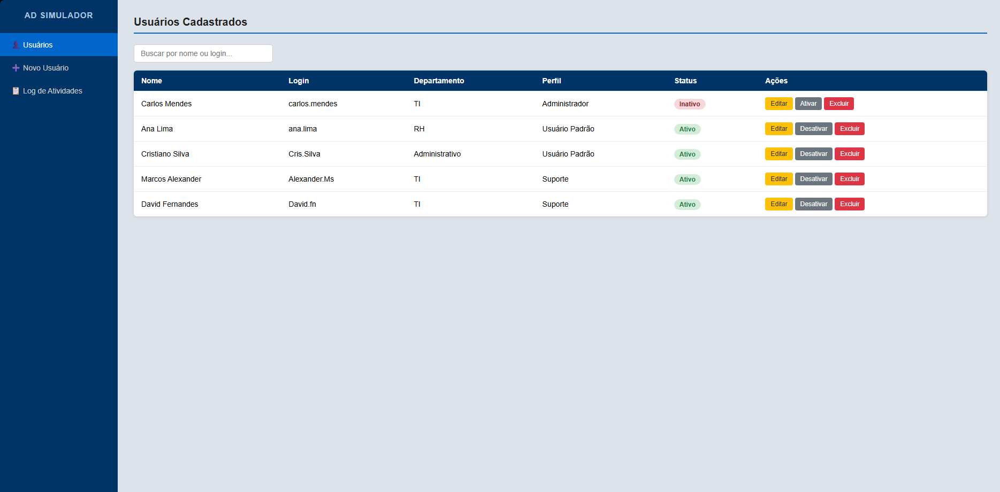
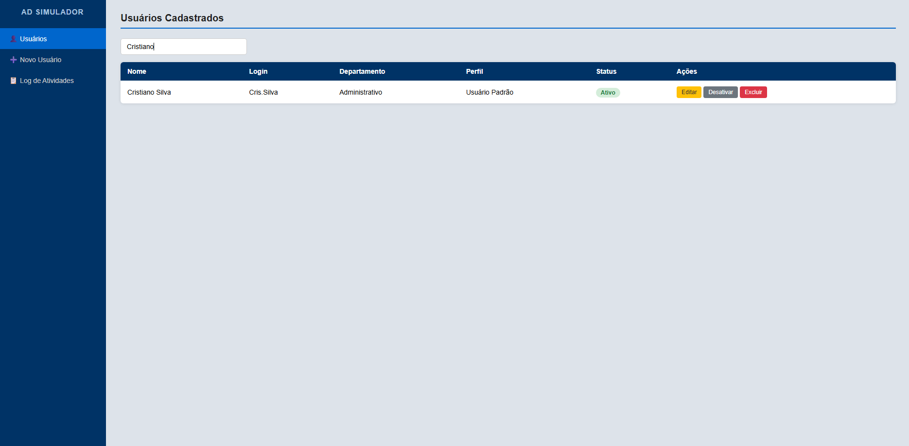
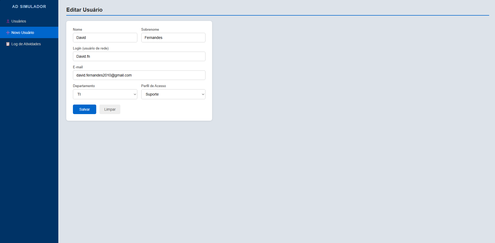
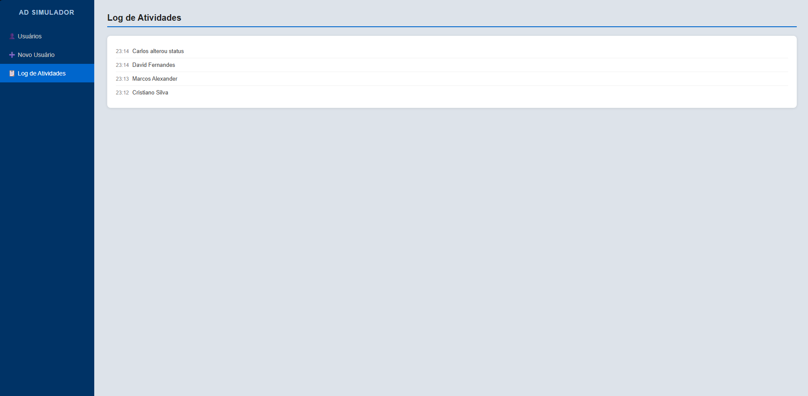

# Active Directory User Simulator

A simple Active Directory user management simulator built with HTML, CSS and JavaScript.

## About the project

This project simulates basic user management routines commonly found in corporate IT support and service desk environments.

It was created to practice JavaScript, DOM manipulation and front-end organization while connecting the project idea to real help desk activities.

## Features

- List registered users
- Add new users
- Edit user information
- Activate and deactivate users
- Delete users
- Search users by name or login
- Register activity logs

## Technologies

- HTML5
- CSS3
- JavaScript

## How to run

Open the `index.html` file in your browser.

## Project purpose

This project is part of my learning path in Systems Analysis and Development, with focus on IT support, service desk routines and front-end development.

## Screenshots

### Dashboard

### Search Users

### Add User

### Edit User

### Activity Log

## Author

Christian Silva
